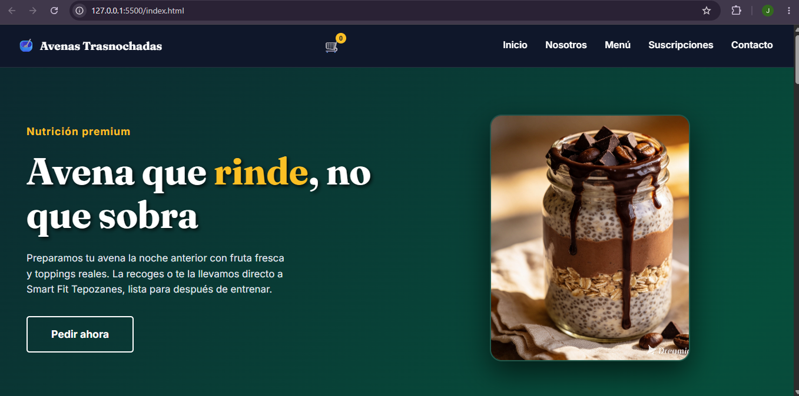
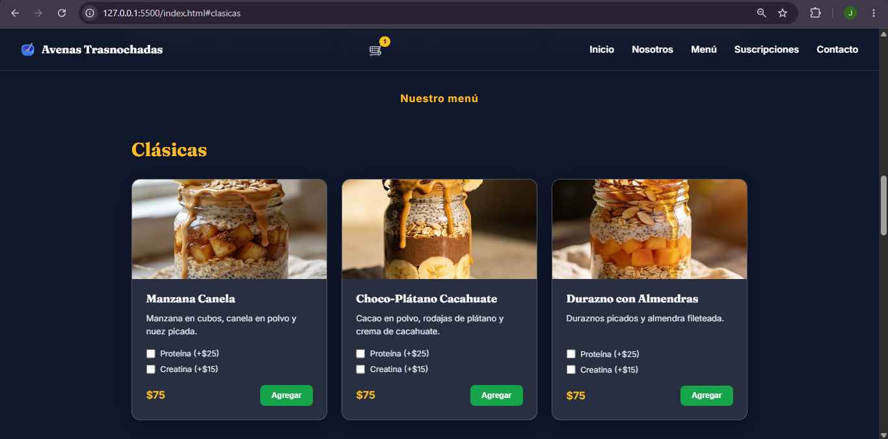
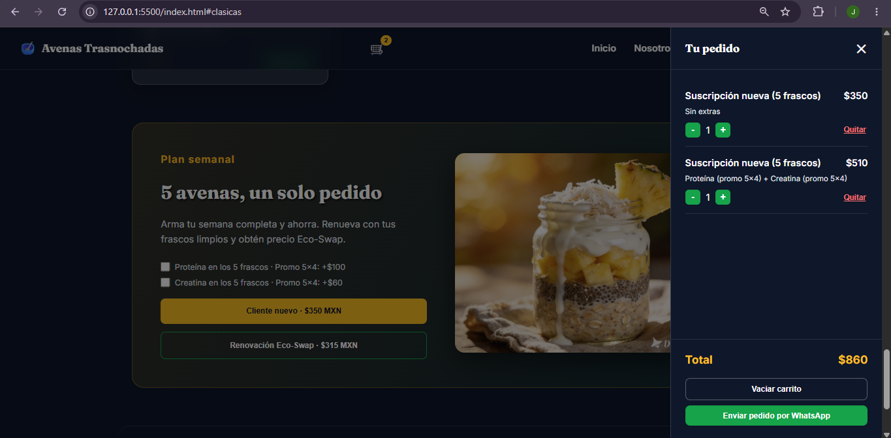

# 🥣 OatFit — Avenas Trasnochadas


Aplicación web interactiva para digitalizar la venta de avenas artesanales orientadas a clientes de gimnasio, optimizando el flujo de pedidos mediante WhatsApp.

🔗 **[Ver proyecto en vivo](https://jhonylopez0507-cpu.github.io/avena-trasnochada/)**

---

## 📑 Tabla de contenidos

- [Descripción](#-descripción-del-proyecto)
- [Características](#-características-principales)
- [Capturas de pantalla](#-capturas-de-pantalla)
- [Tecnologías](#-tecnologías-utilizadas)
- [Estructura del proyecto](#-estructura-del-proyecto)
- [Instalación y uso local](#-instalación-y-uso-local)
- [Roadmap](#-roadmap)
- [Créditos](#-créditos)
- [Licencia](#-licencia)
- [Autor](#-autor)

---

## 📖 Descripción del proyecto

Este sitio fue diseñado y programado desde cero, tomando como referencia estructural una plantilla de "Cafe Website" de Figma y adaptándola a una marca propia de nutrición fitness. El objetivo es ofrecer una experiencia de usuario ágil y moderna, con un carrito de compras funcional y un flujo de pedido que termina directamente en WhatsApp, sin necesidad de un backend.

## ✨ Características principales

- 🎨 **Diseño UI/UX premium** — efecto _glassmorphism_ (cristal esmerilado) sobre fondo oscuro animado.
- 🛒 **Carrito de compras dinámico** — panel lateral en JavaScript puro que agrega productos, permite personalizarlos (proteína, creatina) y calcula el total en tiempo real.
- ♻️ **Sistema Eco-Swap** — descuento automático por devolver envases de vidrio limpios.
- 💬 **Integración con WhatsApp** — arma el mensaje de pedido completo (productos, extras, cantidades y total) y lo envía directo al chat del negocio.
- 📱 **Totalmente responsive** — adaptado a móvil, con menú de navegación tipo _sticky_ y hamburguesa en pantallas pequeñas.
- ⚡ **Sin dependencias** — 100% HTML, CSS y JavaScript vanilla, sin frameworks ni build tools.

## 📸 Capturas de pantalla





## 🛠 Tecnologías utilizadas

| Tecnología              | Uso                                          |
| ----------------------- | -------------------------------------------- |
| HTML5                   | Estructura semántica del sitio               |
| CSS3 (Flexbox, Grid)    | Maquetación responsive y animaciones         |
| JavaScript (Vanilla JS) | Lógica del carrito, WhatsApp e interacciones |
| Figma                   | Referencia de estructura visual              |
| Prettier                | Formato de código consistente                |
| GitHub Pages            | Hospedaje del sitio                          |

## 📂 Estructura del proyecto

```
avena-trasnochada/
├── .editorconfig    # Reglas de formato consistentes entre editores
├── .gitignore       # Archivos y carpetas que Git debe ignorar
├── .prettierignore  # Archivos que Prettier no debe formatear
├── favicon.ico      # Ícono del sitio
├── index.html       # Estructura y contenido del sitio
├── style.css        # Estilos, paleta de colores y animaciones
├── app.js           # Lógica del carrito y WhatsApp
├── img/             # Fotografías de los productos
└── screenshots/     # Capturas de pantalla para este README
```

## 💻 Instalación y uso local

```bash
# Clona el repositorio
git clone https://github.com/jhonylopez0507-cpu/avena-trasnochada.git

# Entra a la carpeta
cd avena-trasnochada

# Ábrelo con Live Server (VS Code) o simplemente abre index.html en tu navegador
```

No requiere instalación de dependencias ni servidor: es un sitio estático.

## 🗺 Roadmap

- [x] Carrito de compras con personalización de extras
- [x] Pedido estructurado vía WhatsApp
- [ ] Conversión a PWA (instalable sin pasar por tiendas)
- [ ] Pagos en línea con Mercado Pago
- [ ] Panel de administración de pedidos

## 🙏 Créditos

Estructura visual inspirada en la plantilla **["Cafe Website"](https://www.figma.com/community/file/1506324037809688269)** de _Azizi Design_, disponible en Figma Community bajo licencia CC BY 4.0.

## 📄 Licencia

Este proyecto es de uso personal/comercial propio. Puedes adaptar esta sección a una licencia [MIT](https://choosealicense.com/licenses/mit/) si más adelante quieres que el código sea reutilizable por otros.

## 👤 Autor

**Jonathan Lopez**
Desarrollado como parte de mi formación en desarrollo web.
